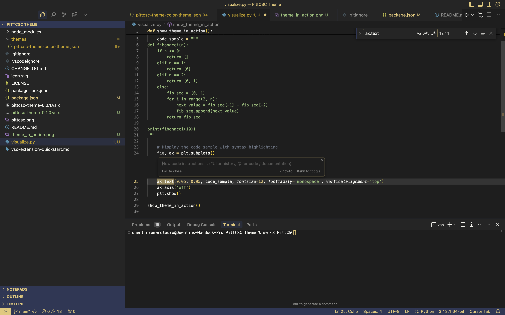

# PittCSC Theme

A VS Code theme for the Pitt Computer Science Club 😎

## Installation

1. Open **Extensions** sidebar panel in VS Code (`Ctrl+Shift+X` or `Cmd+Shift+X`)
2. Search for `PittCSC Theme`
3. Click **Install**
4. Click **Reload** to reload VS Code
5. From the menu bar click: Code > Preferences > Color Theme > **PittCSC Theme**

## Feedback

If you have suggestions or issues, please open an issue on the [GitHub repository](https://github.com/pittcsc/vscode-theme).

**Enjoy coding with Pitt CS pride!** 